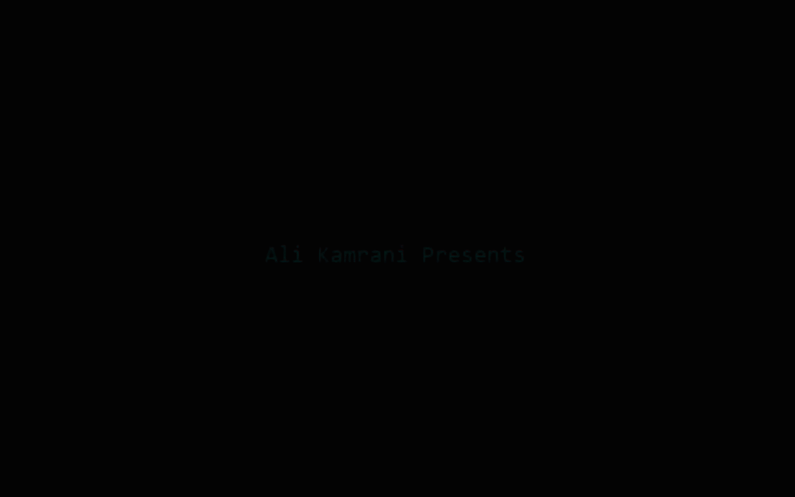

<!-- ===================== GAME BANNER ===================== -->

  

  
  
  
  
  
  
  

# 🚀 NeonPulse: Starstrike

**NeonPulse: Starstrike** is a fast-paced neon arcade space shooter game developed in **Python**.  
This project is now **completely open-source**! We welcome developers, gamers, and enthusiasts to explore the code, modify it, and contribute to the game's universe.

---

## 🎮 About the Game

**NeonPulse: Starstrike** is an arcade-style space shooter focused on fast gameplay, neon visuals, particle effects, and intense enemy waves.

You control a neon-powered spaceship in deep space, dodging enemy attacks, firing laser beams, and facing challenging boss encounters.

### Main Features
- Neon arcade visual style  
- Fast and responsive spaceship controls  
- Laser-based combat system  
- Particle explosions and visual effects  
- Enemy waves and boss fights  
- Dark space environment with glowing elements  

---

## 🎮 Game Intro

> Intro cinematic of the game showing core atmosphere and style

## 🧭 Main Menu

> Main menu showcasing navigation, UI style, and visual theme

## 🤖 AI-Assisted Development

This game was developed with the assistance of **Artificial Intelligence tools**.

AI was used as a supportive tool for:
- Game design and idea generation  
- Visual style direction (neon and pulse-based effects)  
- Code optimization suggestions  
- Concept and asset inspiration  

All gameplay logic, structure, and final implementation were created, reviewed, and customized by the developer.

---

## 🔓 Open Source & Contributions

The source code of this project is **100% publicly available**!

Whether you want to learn how the game was built, use the mechanics for your own portfolio, or contribute to making **NeonPulse: Starstrike** even better, you are fully encouraged to do so. 

**Feel free to:**
- Clone and explore the repository
- Submit Pull Requests (PRs) for bug fixes or new features
- Open issues for suggestions and improvements

---

## ⬇️ Download & Releases (Play the Game)

If you just want to play the game without messing with the code, you can download the latest compiled playable version from the **GitHub Releases** page:

🔗 https://github.com/MRThugh/NeonPulse-Starstrike/releases

---

## 🕹️ How to Play / Run from Source

**To just play the game:**
1. Download the setup or executable file from the Releases page.  
2. Install the game on your system.  
3. Run the game and enjoy. _No additional configuration required._

**To run from source code:**
1. Clone the repository: `git clone https://github.com/MRThugh/NeonPulse-Starstrike.git`
2. Navigate to the folder: `cd NeonPulse-Starstrike`
3. Install dependencies: `pip install -r requirements.txt` *(Make sure to add a requirements.txt if you have one)*
4. Run the main file: `python main.py`

---

## 👨‍💻 Developer

**Ali Kamrani**

GitHub Profile:  
🔗 https://github.com/MRThugh

---

## 📄 License

This project is open-source and available for learning, portfolio, and development purposes.

You are free to use, modify, and expand the project.  
However, proper credit to the original author must be provided when redistributing or building upon this work.

---

_Screenshots, gameplay previews, and updates may be added in the future._
